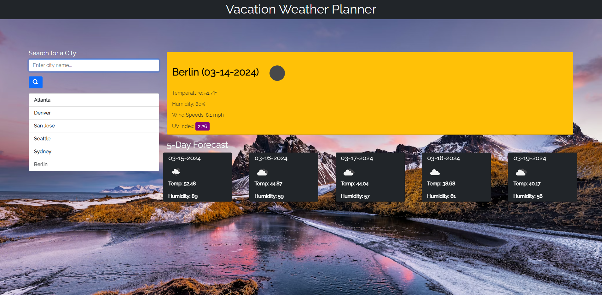

# Weather-Planner

Challenge 6 Weather Dashboard Repository

This is an application that retrieves weather data for cities. It uses the openweathermap API so that the user can track weather data for mulitple cities and plan trips accordingly to the 5 day weather outlook.

Repository Link: https://github.com/hiltyalec/Weather-Planner

Deployed Application Link: https://hiltyalec.github.io/Weather-Planner/